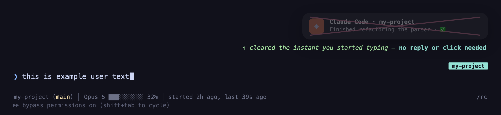

# cc-notify

Native macOS notifications + click-to-focus for [Claude Code](https://www.anthropic.com/claude-code).

When Claude needs your attention or finishes a turn, you get a macOS banner. Click it and you jump to the **exact Terminal.app window, Aerospace workspace, and tmux session/window/pane** where Claude is waiting.

## Quickstart

cc-notify is a Claude Code plugin — there's nothing to run; it fires automatically via hooks. Setup:

```text
/plugin marketplace add FarisHijazi/claude-plugins   # in Claude Code
/plugin install cc-notify@farishijazi-plugins
```
```bash
brew install vjeantet/tap/alerter                     # the notifier (required)
```

That's the whole core — you'll now get clickable banners. Optional extras:

1. **VS Code / Cursor terminal-pane focus + live status tabs** — run
   `"$HOME/.claude/plugins/marketplaces/farishijazi-plugins/plugins/cc-notify/bin/cc-install-editor-extension"`, then reload the editor window. ([details](#optional-focus-the-exact-vs-code--cursor-terminal-pane))
2. **Keyboard hotkey** to "click" the latest banner — [Karabiner rule](#optional-keyboard-hotkey-to-click-the-latest-banner).
3. **Outcome emojis** (✅/❌/👍/👎/💬 on the banner + tab) — add the [token instruction](#per-session-color--name) to `~/.claude/CLAUDE.md`.
4. **Remote sessions over SSH** — banners + click-to-focus for Claude Code running on other machines: [setup](#remote-sessions-over-ssh).

To verify / debug: `bin/cc-notify-doctor`. After a plugin update, re-run `bin/cc-install-editor-extension` if you use the extension.

## Install (via marketplace)

```text
/plugin marketplace add FarisHijazi/claude-plugins
/plugin install cc-notify@farishijazi-plugins
```

Then install the notifier binary (one-time):

```bash
brew install vjeantet/tap/alerter
```

That's it. The plugin's `hooks/hooks.json` registers the `Notification` and `Stop` hooks automatically.

**First click** triggers two macOS Automation permission prompts ("Terminal would like to control Terminal", "System Events"). Allow them once.

## Optional: keyboard hotkey to "click" the latest banner

macOS doesn't natively let you click a notification banner with the keyboard. The plugin ships `bin/cc-banner-click` — a small script that finds the most recent route file and triggers the same focus action as clicking. Bind it to any hotkey.

**Karabiner-Elements** example (Option+Shift+A): add this rule to `~/.config/karabiner/karabiner.json` under `profiles[0].complex_modifications.rules`:

```json
{
  "description": "Focus most-recent Claude Code notification with Option+Shift+A (cc-notify)",
  "manipulators": [
    {
      "type": "basic",
      "from": {
        "key_code": "a",
        "modifiers": { "mandatory": ["option", "shift"], "optional": ["any"] }
      },
      "to": [
        {
          "shell_command": "bash -lc 'exec \"$(ls -dt \"$HOME\"/.claude/plugins/cache/farishijazi-plugins/cc-notify/*/bin/cc-banner-click | head -1)\"'"
        }
      ]
    }
  ]
}
```

The script exits non-zero if no route file exists or focus didn't fire, and the wrapper only dismisses the banner (via `alerter --remove`) on success — so the hotkey is safe to mash.

## Optional: focus the exact VS Code / Cursor terminal pane

By default, clicking a notification from a VS Code / Cursor session focuses the
right **window**. To also jump to the **exact integrated terminal pane** Claude is
running in, install the bundled editor extension (one-time):

```bash
"$HOME/.claude/plugins/marketplaces/farishijazi-plugins/plugins/cc-notify/bin/cc-install-editor-extension"
```

Then reload the window in each editor (Cmd+Shift+P → "Developer: Reload Window").

This is the *only* way to focus a specific integrated terminal — VS Code/Cursor
expose no CLI flag, `vscode://command:` URI, or terminal escape sequence for it.
The extension ([`editor-extension/`](./editor-extension/)) registers a
`vscode://farishijazi.cc-notify-focus/focus?pids=…` URI handler and calls
`terminal.show()` on the terminal whose shell pid matches. See
[LESSONS.md](./LESSONS.md) gotcha #13.

## Per-session color & name

cc-notify reflects two pieces of Claude Code session identity:

- **Color** — `/color` sets `agentColor` in the transcript; cc-notify maps it to a
  colored emoji (🔴🟠🟡🟢🔵🟣🩷🩵) and prefixes the banner subtitle with it (the same
  color your statusline / tmux already show). No `/color` → no emoji.
- **Name** — `/rename` sets `customTitle` (falls back to Claude's auto `aiTitle`,
  then the project folder).

**Terminal tab renaming** (needs the [editor extension](#optional-focus-the-exact-vs-code--cursor-terminal-pane)):
on VS Code / Cursor, cc-notify renames the integrated terminal tab to
`<status> <color> <session name>` (e.g. `👀 🟠 cc-notify`) so you can tell sessions
apart — and see their state — at a glance. The status emoji tracks the session:

| State | Emoji |
|---|---|
| fresh session (startup) | ⏸️ |
| working (turn in progress) | ⏳ |
| needs permission | 🔐 |
| asking you / input | ❓ |
| multiple-choice menu open (AskUserQuestion) | 🔀 |
| done (no outcome token) | ℹ️ |

(⏳ means Claude is **actively working** — not done. "Done" shows an outcome emoji
below, or ℹ️/👀 when there's no token.)

The done state can reflect the actual **outcome** if you instruct Claude to end
each message with a trailing emoji. Priority order (clearest → weakest):

| Outcome | Emoji |
|---|---|
| accident / disaster (**auto-focuses the session** — no click needed) | 🚨 |
| all tasks done, nothing left | 💯✅ |
| task completed | ✅ |
| task failed | ❌ |
| blocked | 🚫 |
| waiting for instructions | 🙋 |
| good news | 👍 |
| bad news | 👎 |
| work to be done | 🏃 |
| just info | ℹ️ |
| still waiting — nothing new (loop/poll/schedule tick; **fires no banner**) | 🥱 |

Add the token rules to your `~/.claude/CLAUDE.md` (Claude appends the first that
applies; cc-notify reads it on `Stop`). Without it, the done state is just 👀.
Ready-made rules: [`docs/cc-notify-tokens.md`](./docs/cc-notify-tokens.md) — copy
it next to your `~/.claude/CLAUDE.md` and add a line `@cc-notify-tokens.md` to keep
CLAUDE.md clean (Claude Code imports `@`-referenced files).

cc-notify reads that trailing emoji from the transcript on `Stop`. Without it, the
done state is just 👀 "your turn".

**Emergency auto-focus**: the 🚨 token doesn't wait for you to click the banner —
on `Stop` it immediately jumps you to the session (same routing as a banner click:
window, Aerospace workspace, tmux pane). The banner still fires as the visible
record. This runs even when Stop banners are disabled via
`~/.claude/notify.disable_stop` — an emergency overrides everything.

It's driven by a state file the extension watches (`/tmp/cc-notify/<sid>.tab`) —
**no `open`/URL**, because opening a URL scheme activates the editor and steals
focus across spaces. The extension renames via the terminal API without raising the
window, so it never disturbs you. Native tab *color* isn't settable by any VS Code
API, so the color rides along as the emoji prefix.

A **background** terminal's tab can only re-render when it becomes active, so when a
backgrounded session changes state (e.g. finishes: ⏳→✅) its tab would stay stale
until you focus it. To fix that, cc-notify **auto-sweeps** on settled events (`Stop`,
`Notification`, `SessionStart`, `SessionEnd`): it touches `/tmp/cc-notify/.sweep`,
which every editor window's extension watches and responds to by briefly cycling its
terminals (`focusNext`) so each tab repaints, then landing back where it started. The
sweep is **throttled** (≤1 / 10 s), **skipped while you're typing** (no keystroke in
the last 3 s — read live from the OS, no daemon/permissions), and **queued** if
blocked (it fires the moment you stop typing) — so it never interrupts you mid-type.
Mouse movement doesn't block it.

Hooks only fire on events (and only in sessions started after a plugin update), so
for a steady heartbeat that repaints tabs even when nothing is happening, install the
**60s sweep agent** (one-time):

```bash
"$HOME/.claude/plugins/marketplaces/farishijazi-plugins/plugins/cc-notify/bin/cc-install-sweep-agent"
```

It installs a launchd LaunchAgent that runs `cc-sweep` every 60s. Each tick obeys the
same guards (throttled, skipped while typing, queued if blocked), so it's invisible
while you work. Re-run it after a plugin update; `--uninstall` removes it.

**Disable sweeping entirely** (tabs then only update on focus / the next turn in
that window):

```bash
touch ~/.claude/notify.disable_sweep   # no more sweeps anywhere
rm    ~/.claude/notify.disable_sweep   # re-enable
```

The flag is honored by the extension, `cc-sweep`, and the hook trigger. Reload the
editor window once so the extension picks it up. (The heartbeat agent is separate —
remove it with `cc-install-sweep-agent --uninstall`.)

## Per-project color (`.cc/settings.json`)

Claude Code has **no programmatic API for the session color** — no CLI flag for
a running session, no env var, no settings key, no hook field (all have open
feature requests). But the `/color` slash command accepts an inline argument, so
cc-notify syncs color through the session's own input box:

- Whenever you `/color` a session, its hooks persist the choice to
  `<project>/.cc/settings.json` as `{"color": "purple"}` (folder auto-created;
  other keys in the file are preserved; the last active session in a project
  wins).
- On **SessionStart**, if that file's color differs from the session's, cc-notify
  types `/color <name>` into the session's own tmux pane — so every new session
  in the project comes up in the project's color automatically.

The typing uses the same safety dance as [banner dismiss-on-typing](#banners-clear-when-you-start-typing)
(`bin/cc-prompt-state`): it only ever types into an **empty** input box, verifies
the box holds exactly the command before pressing Enter, and backs off entirely
if you're typing or a menu/dialog is open. tmux-hosted sessions only. You'll see
the `/color <name>` flash by as a submitted command at session start — that's it
working. Add `.cc/` to your `.gitignore`.

```bash
CC_NO_COLOR_SYNC=1                            # env off-switch
touch ~/.claude/notify.disable_color_sync     # file off-switch
CC_COLOR_APPLY_TIMEOUT=25                     # how long to wait for the input box
```

You can also just edit `.cc/settings.json` by hand — any of
`red orange yellow green blue purple pink cyan default`.

## Banners clear when you start typing



A banner is cleared as soon as you **start typing in the session it came from** —
you've obviously seen it, so it shouldn't sit there until you submit or click.

Claude Code doesn't expose *unsubmitted* input to any hook or API, so cc-notify
reads the input box off the tmux pane (`bin/cc-prompt-state`). It only counts a
**change** from what was in the box when the banner appeared, so text you'd
already typed doesn't dismiss it instantly. This needs the session to be running
inside tmux; elsewhere the banner still clears on reply or click.

```bash
CC_NO_TYPE_DISMISS=1   # turn it off
CC_TYPE_POLL=2         # seconds between checks (default 1)
```

The same helper is what lets a "type something into this session" automation
know when to keep its hands off — it reports *empty* / *user is typing* / *no
input box at all* (an AskUserQuestion menu or permission dialog), so nothing
gets typed into a menu or appended to a half-written message.

## Remote sessions over SSH

Claude Code running on another machine can notify this Mac, and clicking the
banner lands you in the session — same as a local one.

It leans on [tmux-watch](https://github.com/FarisHijazi/tmux-watch), which
already tiles remote tmux sessions into a local hub and tags each pane with
`@tw-src = "<host>\t<session>"`. That tag is a stable address for "the local
pane showing that remote session", so all cc-notify has to add is a one-way
event stream.

```bash
bin/cc-install-remote <host> [host...]   # remote half: 2 files + hook registration
bin/cc-install-remote-agent              # local half: keeps the listener running
tmux-watch <host>:<path>                 # so clicks have somewhere to land
```

Run remote Claude sessions **inside remote tmux** — that is what makes the click
routable. Requirements on the remote: `bash`, `tmux`, key-based ssh. No node, jq
or python needed there; all JSON work happens on the Mac.

### How it flows

1. The remote's hooks (`hooks/cc-remote-emit.sh`, installed to
   `~/.claude/cc-notify/`) append one JSON line per event to
   `~/.claude/cc-events.jsonl`. They decide nothing — they report facts only its
   own machine knows: the transcript's colour, title and outcome token, its
   tmux coordinates, the cwd and branch.
2. `bin/cc-remote-bridge` on the Mac holds an ssh connection per host running
   `tail -F` on that file, and stamps each event with **the ssh alias you
   connect with** — which is why identity translation has exactly one home (the
   remote knows only its own hostname; the local pane is keyed by the alias).
3. Each event becomes the same banner a local session produces (shared
   presentation code, so the vocabulary can't drift), plus a route file for the
   click handler, plus a live status on the hub pane's border.
4. Clicking re-resolves the pane **at click time** from `@tw-src` — panes come
   and go — then focuses it exactly as a local session: Aerospace window, tmux
   session/window/pane. If nothing on this Mac is showing the session, it opens
   a Terminal window attached to it instead.

The hub pane border becomes a status board: `⏳ 🟢 deploy api` for a remote
session, exactly like the terminal-tab titles local sessions get (a remote
session has no local terminal tab, so the border is its equivalent). Local
sessions tiled into a hub get it too.

Everything else follows for free: 🚨 still auto-focuses, replying still clears
the banner, and dismiss-on-typing works because the hub pane *is* the pane you
type into.

### Operating it

```bash
bin/cc-remote-bridge --hosts    # which hosts are being bridged and why
bin/cc-notify-doctor            # section 7 shows streamers, hub panes, statuses
tail -f /tmp/cc-notify/remote-bridge.log
```

Hosts are **discovered**, not configured: any host with a tmux-watch pane on
this Mac is bridged. Pin extra ones (or hosts you have no hub for) in
`~/.claude/notify.remote-hosts`, one per line.

```bash
touch ~/.claude/notify.disable_remote   # stop bridging (local half)
bin/cc-install-remote-agent --uninstall # remove the launchd agent
bin/cc-install-remote --uninstall <host>  # remove the remote half entirely
```

Reconnects are automatic, and on reconnect the last 60s of events are replayed
so a blip doesn't swallow a "done" ping — already-handled events are suppressed
by timestamp, so nothing fires twice. The remote's hooks are registered in its
`~/.claude/settings.json` (backed up to `settings.json.cc-bak`; existing hooks
are preserved, and `--uninstall` removes only cc-notify's).

**Trust note:** event lines are treated as untrusted text from another machine —
parsed as JSON into shell variables, never evaluated, and a remote session name
is only used to open a window if it is a plain tmux name.

## Toggle Stop notifications

`Stop` fires the moment Claude is **fully done** — after every subagent has
returned and the final response is written (background shells/watchers don't hold
the turn open). cc-notify fires on it **immediately** rather than relying on Claude
Code's ~60s idle Notification, so "done" pings are instant. Two opt-outs, both off
by default:

1. **Global kill-switch**: while `~/.claude/notify.disable_stop` exists, Stop never fires.
2. **Suppress when focused** (opt-in): while `~/.claude/notify.suppress_when_focused`
   exists, Stop is skipped when the originating window is already frontmost. Off by
   default — the frontmost detection is unreliable in VS Code/Cursor and was eating
   legitimate pings.

```bash
touch ~/.claude/notify.disable_stop          # silence Stop entirely
rm ~/.claude/notify.disable_stop             # re-enable

touch ~/.claude/notify.suppress_when_focused # don't ping the window you're on
rm ~/.claude/notify.suppress_when_focused    # always ping (default)
```

**Permission** `Notification`s always fire a banner — those are the high-signal
ones. The **idle** `Notification` (Claude Code's ~60s "waiting for your input")
is **tab-status-only — no banner** (it updates the terminal tab to ❓ but doesn't
ping); it's low-signal and noisy, and the instant `Stop` ping already covers "done".

## Click-routing by terminal

| Terminal | Behavior |
|---|---|
| **Terminal.app + tmux** | AppleScript-by-tty finds the exact window/tab, Aerospace switches workspace, `tmux switch-client` + `select-window` + `select-pane` jumps the pane. |
| **Ghostty + tmux** | Captured Aerospace window id (local) or, for a remote session, Ghostty's AppleScript dictionary (1.3+): the tab whose name is the tmux title (`set-titles on` with a stable `set-titles-string`, see the dotfiles `.tmux.conf`) is focused, then Aerospace switches workspace by that title, then tmux jump. A remote session nothing is showing opens in a new Ghostty window via AppleScript `new window with configuration` (never `open -na`, which spawns a second Ghostty process). |
| **iTerm2 + tmux** | `open -a` + tmux jump. |
| **VS Code / Cursor integrated terminal** | Focuses the existing editor window whose workspace folder matches `cwd` (exact, then closest parent dir) via Aerospace — no `--reuse-window` (which would re-open a sub-folder as a new view). **With the [companion extension](#optional-focus-the-exact-vs-code--cursor-terminal-pane) installed, it also focuses the exact integrated terminal pane** Claude runs in. |
| **Claude Code on a remote box (SSH)** | The remote's hooks append events to a file; this Mac streams it over ssh and fires the same banner. Clicking focuses the local tmux-watch hub pane showing that session — or opens a Terminal attached to it if nothing is showing it. See [Remote sessions](#remote-sessions-over-ssh). |

## Why alerter and not `osascript`

`osascript -e 'display notification'` is truly native but **not clickable** — Apple removed the click-callback path for unsigned scripts in 10.14+. `alerter` uses modern `UNUserNotificationCenter` and returns click signals to stdout. `terminal-notifier` is broken on macOS Tahoe (uses deprecated `NSUserNotification`).

## Icon

The banner always carries an **orange Claude mark** as a right-side content image.

The notification *icon* (left square) can only be overridden by impersonating an
app's bundle id (`alerter --sender`); on modern macOS (Big Sur+) a custom
`--app-icon` is ignored. Impersonating `com.anthropic.claudefordesktop` gives the
orange Claude logo — **but macOS silently drops notifications sent under a bundle
id that lacks notification permission, and `Claude.app` usually has none** (most
people run the Claude Code CLI, not the desktop app). That kills the banner and
leaves only the terminal bell. So the Claude icon is **opt-in**:

```bash
# 1. Launch Claude.app once and allow its notifications (System Settings → Notifications → Claude)
# 2. then:
touch ~/.claude/notify.claude_icon    # use the orange Claude logo as the icon
rm   ~/.claude/notify.claude_icon     # back to the default authorized sender (reliable banners)
```

## How it works

1. Hook fires → `cc-notify.sh` captures context (term, tmux session/window/pane, client_tty, cwd) and writes a route file to `/tmp/cc-notify/<sid>.route`.
2. Hook spawns `cc-notify-bg.sh` fully detached via `( bash ... & )` — parent returns in <100ms.
3. `cc-notify-bg.sh` blocks on `alerter`; on click, invokes `cc-focus.sh`.
4. `cc-focus.sh` reads the route file, runs AppleScript to find the matching Terminal tab by `tty`, switches Aerospace workspace if needed, then `tmux switch-client` + `select-window` + `select-pane`.

For the non-obvious gotchas hit during development (alerter `@ACTIONCLICKED` quirk, tmux clobbering `TERM_PROGRAM`, detached spawn pattern, etc.), see [LESSONS.md](./LESSONS.md).

## License

MIT.
